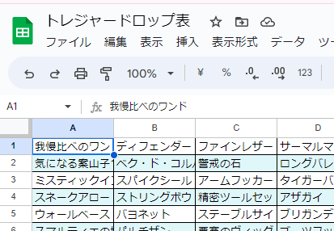

# トレジャードロップ表

以下のような表を参照して[discord-bcdiceのオリジナル表](https://shunshun94.github.io/discord-bcdicebot/index.html#howToUse-admin-originalTable)のオリジナル表を振るための GAS。

## 振り方

オリジナル表の名前を「SWTD」とした場合、`SWTD A` とすると A 列の内容からランダム抽選して返却する。

## 環境変数

### `CHEAT_CODE`

表の名前の直後にここで指定した文字列を書き込み、コマンドの末尾に数字を入れることでダイスの出目をその数字に固定する。
ただ、この文字列は誰でも見れるので不正行為には使えない。
